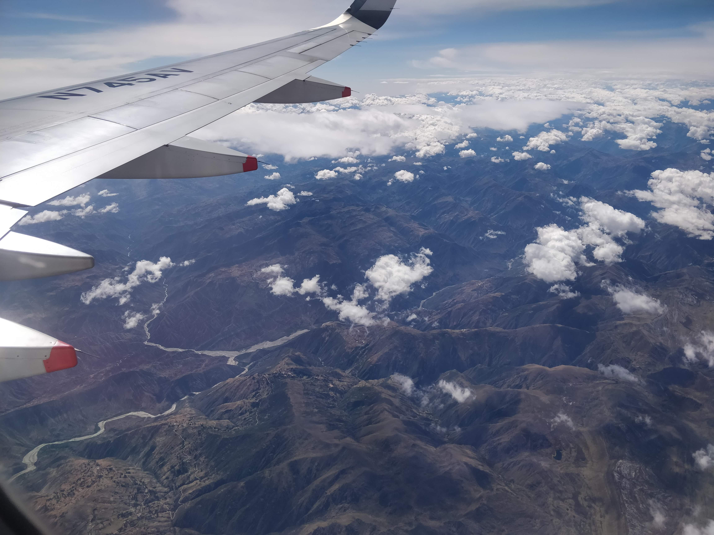
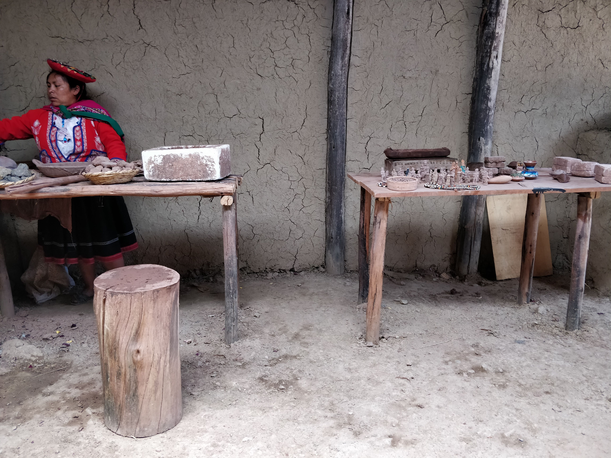

I did the 4d/3n Inca trail during Nov 2019, and was in total awe of my experience. This series of blog posts summarizes my experiences during the trip.

### How the trip happened?
As I was turning 25, I wanted to gift myself something exciting - Like a vacation in a country I hadn't visited before!
I've a preference for traveling alone, mostly because I feel it's too much effort to convince other friends to join me
and coordinate the planning with them. So, I looked up tour operators who worked with solo travellers and found GAdventures (hereby referred to as G).

I browsed through their offerings and my eyes landed on the Inca Trail. I love hiking and losing myself in the quiet of 
nature. And I had never done such an intensive hike involving camping in the mountains before. The hike being laden with history was just the icing on the cake.

The Inca trail is regulated by the Peruvian government, they only allow 500 people on the trail per day. So, people book
their trips 4-5 months in advance. The peak season for doing the trail is May - Sept, however I couldn't find a date during that season. I ended up booking my trip towards the end of October (the onset of the rainy season :pensive:), however my heart was set on doing the hike so I didn't really care!

I finally ended up booking the [Inca Discovery trip](https://www.gadventures.com/trips/inca-discovery/PID/) from Oct 26 - Nov 4.

### Preparation for the hike
As part of my research I read people's experiences on the hike. The common themes I found in them were:  

1. It's a hard hike - *a knee killer*.  
2. The views are beautiful.  
3. There's a lot of Incan history on the trail.  
4. Altitude sickness can be a real issue.  
5. The weather can change rapidly between cold, hot and rainy during the day. 
6. Good hiking gear is highly recommended.

I decided to prepare myself for the hike by working out on the stair master. I started off with 100 floors in 30 min and
got upto 130 floors in 30 min by the time I was leaving for my trip. The prep for the hike kept me motivated me to hit the gym. And I developed a habit out of it, so thank you Inca trail!

I didn't really know whether I would suffer from altitude sickness because I've never spent much time in high altitudes. Thankfully I got a chance to visit Denver, Colorado a few weeks before the trip. I decided to do the [Royal Arch](https://dayhikesneardenver.com/royal-arch-trail-hike-in-boulder-colorado/) trail while I was there. I got a sense of hiking at an altitude - it's important to pace yourself initially, and drink tons of water.

We didn't study much about the Incan culture in Indian schools, so I decided to use this opportunity to learn more about them. I read Mark Adams' [Turn right at Macchu Picchu](https://www.amazon.com/dp/B004XFYIDS/ref=dp-kindle-redirect?_encoding=UTF8&btkr=1). It was a light, enjoyable read about the experiences of an urbane New Yorker hiking the Andes.

I read through several packing guides for the Inca trail and bought most of my hiking gear at the REI in Soho. Some of the key purchases I made were:  

1. Merrell Men's Moab 2 Vent Mid Hiking Boot.  
2. Osprey Stratos 24L Day Pack and 3L hydration pack (highly recommend getting the hydration pack).  
3. Medium weight Fleece Jacket.  
4. Celestron Outlander Binoculars.  
5. Merino wool hiking socks (highly recommend).  

I could get a visa on arrival at Peru thanks to my Indian passport and US visa. But G also helps you out with
applying for the visa if needed.

### Departure to Peru
G was super helpful in giving all the neccessary information needed for my arrival. They sent me an email containing the
info of my CEO (Chief Experience Officer, G's version of a tour guide), where I would meet the rest of the group and
a reminder of the essentials to pack.  

> Kudos to G for making my departure anxiety-free by providing me with all the required information

### In Lima!

> You can start seeing the Andes mountains even as you're flying into Lima.

I spent two days in Lima before heading to Cusco. Lima is a beautiful cosmopolitan city. The Miraflores neigborhood, where I stayed was quite tourist friendly. 

> I spent some time at the beach facing Miraflores park enjoying the sunset.

Lima (also known as the city of kings) has a lot of history around it - It was the capital city of the invading Spaniards founded in 1532. The city's downtown area buildings are all heavily inspired by the European architectural patterns of the time.

I took a walking tour of the city's downtown district with a local. We went to the catacombs, checked out the city square and made some delicious pisco sour!



> Be sure to try the Pisco Sour while you're in Peru!

### To Cusco
Cusco is the closest big city to Macchu Picchu. While Lima is cosmopolitan, Cusco is culturally rich. It's also very touristy since all the travellers to Macchu Picchu go through Cusco. Cusco is located at an altitude of 11000 ft., and is therefore a good place to get acclamatized to the altitude before you begin the hike.  

In Cusco, we met our CEO for the Inca trail, Nick. He was warm, welcoming and funny. He gave us a detailed overview of what to expect over the hike.



> The presentation covered the distance, altitude and duration we would hike each day.

### A day appreciating the local communities!
G is backed by [planterra foundation](https://planeterra.org/), a non-profit committed to social tourism. We spent a day visiting three of the communities locally supported by G in the sacred valley:  

* ##### Ccaccaccollo Community and Women's Weaving Co-op  
We met a group of women weavers who work magic with alpaca wool. They showed us all the different stages the wool goes through before it becomes the final product. They also demoed how they combine different natural ingredients with crushed Cochineal beetles to color the wool (which was so cool!).  
  
And the best part of it all, I got to hang out with an alpaca!  
Although it did spit on me, that's how alpacas make friends y'all!

* ##### Cuyo Chico Pottery Making Demonstration   
This was a group of clay potters who made cool clay pottery items. We got a chance to buy cool clay fridge magnets of the Macchu Picchu. And a funky chess set - the pieces were the Incas against the spaniards! 

* ##### Parwa Community Restaurant  
When we walked into this place, I genuinely thought I was in the swiss alps! We had a delicious 4-course meal including a soup, appetizers, a vegetarian main course item (they were kind enough to take my dietary pref. into account), and dessert. To top it off I got the Cusqueña beer, a Peruvian lager (which I also highly recommend trying!).  
  
This was followed by a food coma, nearly all of us slept like logs all the way to our next stop - Ollantaytambo. 

### Peruvian Food

This trip wouldn't have been as memorable if not for the food! Peruvian cuisine is now my second favorite after Indian :smile:  
I loved it so much that I decided to write a haiku on it: 

> Peru, your food yum  
> total silence while eating  
> A big smile after

I can't write about Peruvian food without mentioning the potatoes. There are over 3000 kinds of potatoes grown in Peru! Needless to say we ate potatoes in almost all our meals - and each kind was so unique!

Nearly every dish I ate during the trip was unique, and unforgettable. But here are some of my all time favorites:  

* [Picarones](http://perudelights.com/picarones-peruvian-doughnuts-bunuelos-or-beignets-are-one-of-a-kind/) - sweet potato doughnuts 
* [Pisco Sour](https://www.epicurious.com/recipes/food/views/pisco-sour-234357) - whiskey sour but with pisco
* [Quinoa Chaufa](https://beyondmeresustenance.com/quinoa-chaufa/) - Peruvian take on the quinoa fried rice

In my next article I'm going to write about the hike itself, watch out for that :smile: