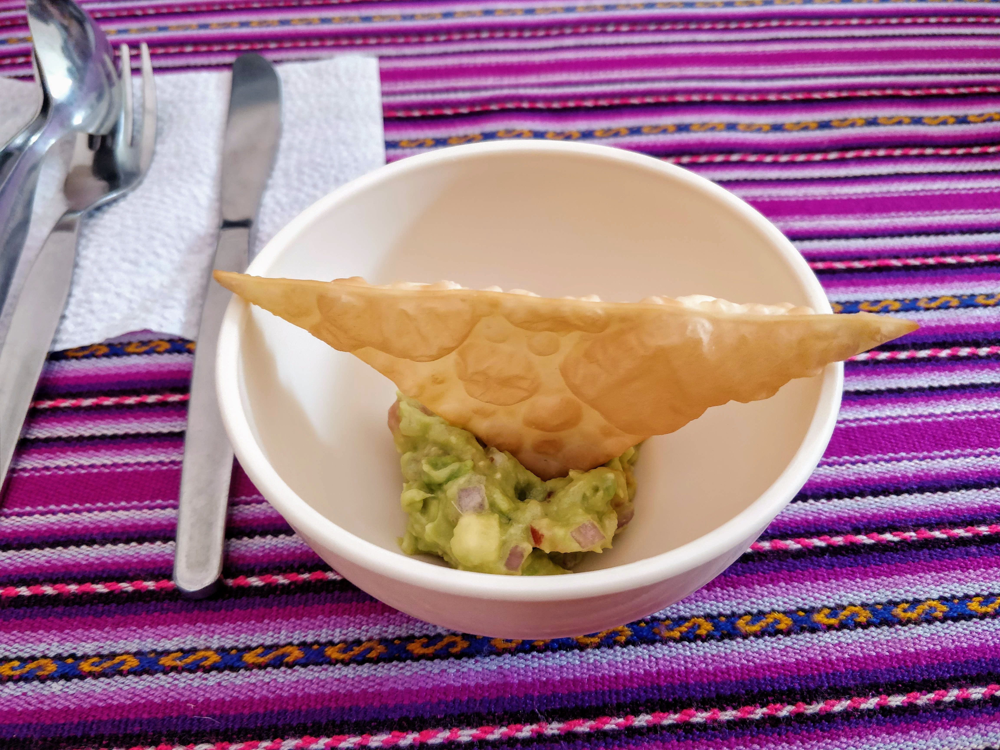
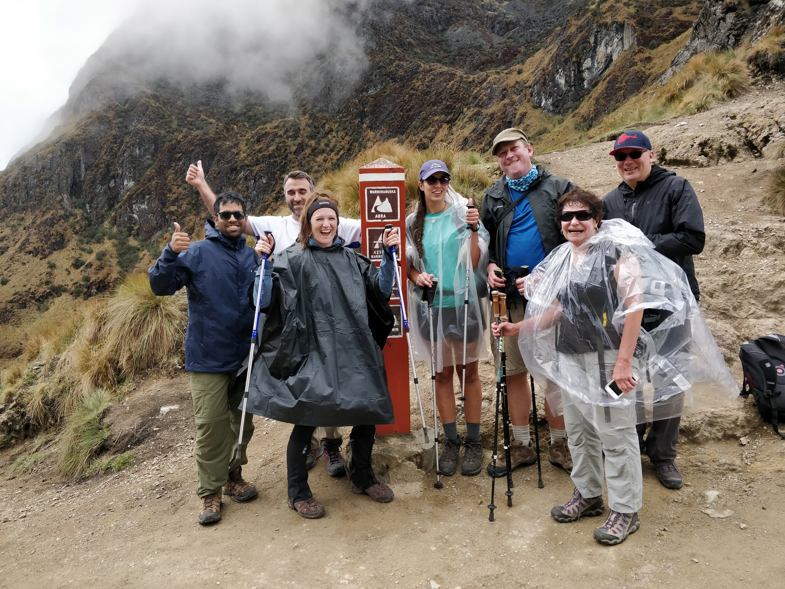
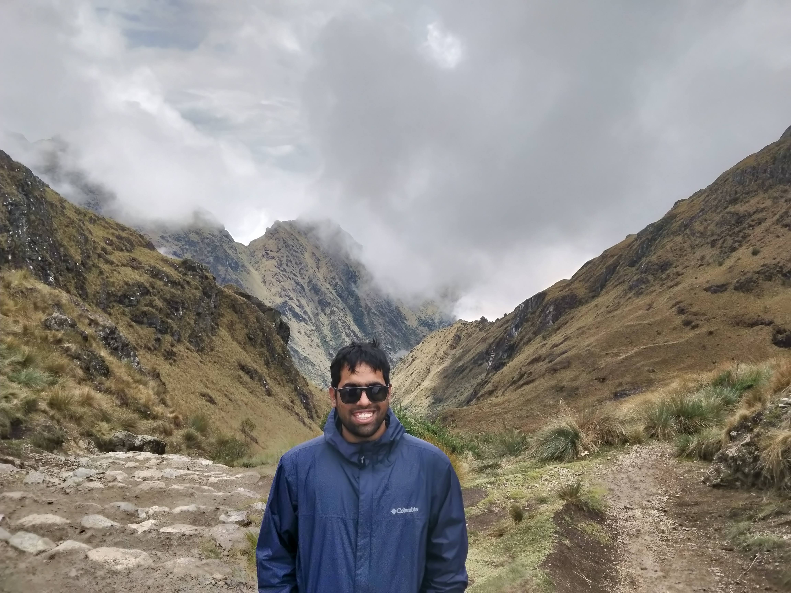
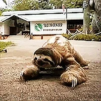
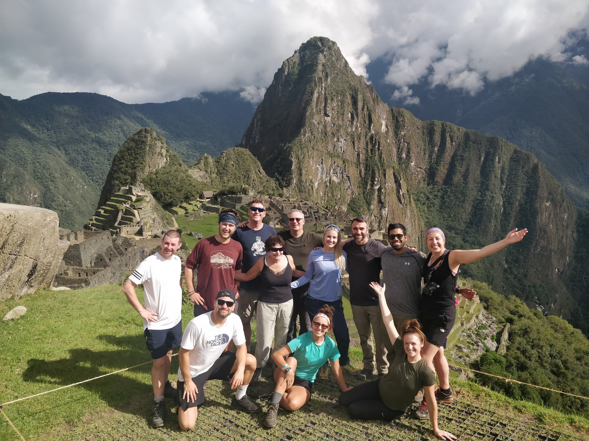

I did the 4d/3n Inca trail during Nov 2019, and was in total awe of my experience. This blog post summarizes my experience on the trail.

## Prologue
> I want you to remember one thing - "PMA". It stands for **positive mental attitude**. It's the single most important thing I want you all to have. PMA can cure pain, move mountains, take you where you want to go. NEVER LOSE YOUR PMA!  

-- Nick, our guide on the trail.  

## Day 1
The Inca trail begins at KM 82 in the Ollantaytambo town. Everyone in our group was excited to begin the journey they've all been waiting for (some of them for years!). Everyone was up by 6.30 AM, packed and ready to go. Our guide Nick, handed us the hiking poles, sleeping bags and the sleeping mat we rented. The moment of reconning came to me when I first held my hiking poles. I was going on the Camino Inka trail! We met our other guide for the hike Sara before leaving for the trail head. 

We showed up at the entry point to the trail where the government officials checked our passports and permits for the trail. It was a smooth process, and we saw several other groups of hikers all equally excited as we were. 
  

#### And thus the hike began!   

Our guide Nick gave us a few tips which would turn out to be super useful during the rest of the hike: 

* There are several porters also hiking the trail. They go at a much faster pace (sometimes running on the trail) and might accidentally knock you down the cliff if you don't pay attention. Whoever noticed approaching porters would yell *"Poooorterrrs"* and everyone would move to the cliff side. This became a fun porter spotting game for everyone!  
* Go at your own pace - take as many breaks as necessary and drink plenty of water!  
* And finally Nick said *"We start this hike as a group but end it as a family"* - we named this family **The Inca warriors**.  

The hike up until lunch was quite tiring, mostly because we were still getting used to the weights on our back and the heat.
Once we made it to our lunch campsite, we were completely mesmerized! We had a few porters waiting for us there and cheering us on as we made it to the campsite. They served us with lemonade and a bowl of hot water to wash ourselves. We felt like royals :heart_eyes:. We were treated to a delicious four course meal filled with healthy veggies. 
  

> I still dream about the guac and chips I had for lunch at that site!  

We had more back breaking hiking ahead of us as we made our way out of the lunch site. Looking up at the path ahead of us was scary, and to be honest drained all my hope. Peggy, one of my fellow hikers said *"Look how far you've made, and be proud of your accomplishments!"*. It was small things like this that made my trek so much easier.  

On our way up we saw our first Incan site - **Llaqtapata**. It was a construction site. Since building in the Andes mountains is challenging - the workers would construct sites to rest and spend the night as they constructed buildings higher and farther away.
  

We eventually made our way to the final campsite by 5 PM. We had our tents setup for us by the porters. Hot water bowls and welcome drinks were now a staple.  
  
We got lucky in that we got a campsite right by a cabin with a bar. How cool is that?! A cozy cabin right in the mountains with a bar?! Although Nick didn't let us get drunk :sob:  

We did get a delicious hot beverage (Peruvian coffee is amazing!) and a 3 course sumptuos dinner. We got our first taste of the coca tea, a local drink. It's made of coca leaves (the same leaves cocaine is made from), and is said to help with altitude sickness.  

As it became dark, it was funny to see everyone go about wearing their headlamps (myself included), kinda like the scientists in a low-budget Sci-fi horror movie :stuck_out_tongue_closed_eyes:

We hit the bed (sleeping bags) and slept under the stars in our tents. It was my first time sleeping in a bag and I absolutely hated it. The bag is shaped like an Egyptian mummy, and I felt sorry for the mummies wrapped so uncomfortably :neutral_face: I barely slept turning this way and that, trying to find a comfy angle in the bag.
## Day 2
Nick told us that the second day of the hike was the hardest - we would gain 1115 m in elevation. I had mixed feelings, I was excited about the views but petrified that I would slow the group down. We split up our hiking group into two - the ninjas and the sloths (of which I was part). The groups hiked like their namesakes, and both had great stories to share when we met for lunch and at the final campsite.  

  

> The sloths!

I followed [the Pomodoro technique](https://en.wikipedia.org/wiki/Pomodoro_Technique) during the hike - I would focus on getting the hike done and nothing else from one point to the other, until our group decided to take a break. I noticed that by focussing on the process of the hike as opposed to reaching a goal, I enjoyed the hike more. Another great advantage of being with the sloths was we got a lot of opportunities to stop and take plenty of pictures!  

  

> Observe how different the terrain looked on the second day compared to the first day.   

So far we hadn't faced any of the fast-changing mountain climate I heard a lot of - and that changed :worried:
We faced a little rain as we made our way up the incline, just a little though. Light enough to be able to hike with rain gear on. It was my first time hiking in rain, and I thoroughly enjoyed it!  

> We made it to the peak (the dead woman's pass) at an elevation of 4300 m close to 12 PM. The views were phenomenal!   

We made our way down the incline from the peak and got our first taste of the steep Incan steps. I read so much about how hard they were but nothing could've prepared me for them. Getting down the steep assortment of stairs requires skill using the hiking poles and upper body strength to support yourself descending. I was miserable for the first hour or so before getting used to it. Although the mountain llamas we spotted while descending made it all worth it :smile:  

We reached the campsite close to 4 PM, a full 3 hours behind the Ninjas standing by our group name - *the sloths*  

  

> Live footage of the sloths hiking :sweat_smile:

## Day 3
Day 3 of the hike were the most picturesque and historic parts of the hike. Although we went down the incline the whole day, I thought it was the hardest hike of all the days. Coming down steep, irregularly arranged steps involves placing your hiking poles carefully and using upper body strength to bring yourself down. There were several parts of the day when I cursed out loud when I twisted my ankle while going down - but the rest of the sloths encouraged me to keep going with my **PMA**. Honest to god I don't think I'd have made it without their cheering me on!  

  

> We saw several Incan ruins through the day!

It was also the longest day of our hiking, we began at 7 AM and ended at 6 PM. But once we made it to our campsite everyone forgot all their pains and rejoiced that we were almost at Macchu Picchu!  

Nick, our CEO introduced all the members of our crew who hiked with us. We thanked them for all the amazing food, and carrying our camping gear for us.  

To our dismay Nick told us that rain was in the forecast for the next day. But that said, Nick insisted that our PMA could change weather too. I wasn't as disappointed with the downturn the weather took, for me the hike already made everything worth it. 
## Day 4
Today was the day we would be at Macchu Picchu. To provide context, the sun gate which is also a lookout point to the Macchu Picchu would be first opened to the hikers from the trail at 5 AM. To get there and take good pictures, we camped at the entry to the hiking point to the sun gate at 3 AM!  

> I had never thought I would play the 20 questions game with a bunch of strangers at 3 AM in remote Andean mountains!    

As the gates opened, everyone was bursting with energy! The hour long hike felt like minutes. And we made it with perfect weather at the Macchu Picchu, our **PMA** worked after all!

  

> The Incan warriors family!

## Epilogue
> This was the best fu**ing beer I've ever had in my life, cheers!  

-- Dan, a co-hiker at the cafe in Macchu Picchu after the hike. 